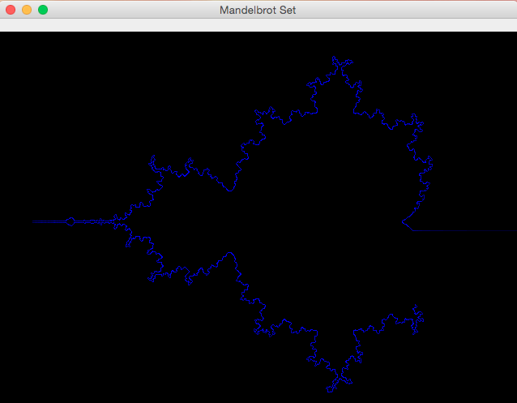

# Wator

**Wator. Population Dynamics on Planet Water Torus.**

## Abstract: Wator


## More
* [https://en.wikipedia.org/wiki/Mandelbrot_set](https://en.wikipedia.org/wiki/Mandelbrot_set)
* [https://en.wikipedia.org/wiki/Julia_set](https://en.wikipedia.org/wiki/Julia_set)
* [https://en.wikipedia.org/wiki/Turing_machine](https://en.wikipedia.org/wiki/Turing_machine)

## Screenshots

### Running around the Edge of the Mandelbrot Set


### Running around the Edge of the Mandelbrot Set



### Computing the Area outside the Mandelbrot Set


### Clicked somewhere on the Edge of Mandelbrot Set: The Julia Set


### Clicked  on another Point on the Edge of Mandelbrot Set: The Julia Set


### Git Repository
* [https://github.com/Computer-Kurzweil/wator](https://github.com/Computer-Kurzweil/wator.git)


### Run the Desktop Application
```
git clone https://github.com/Computer-Kurzweil/kochsnowflake.git
cd kochsnowflake
./mvnw
```
