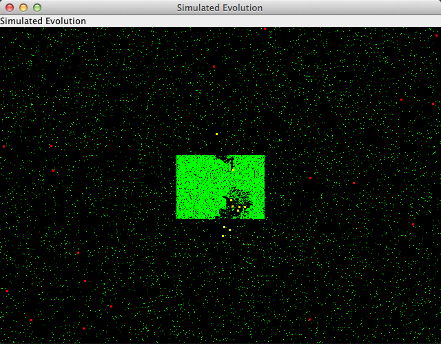

# Wator


**predator–prey Population Dynamics on Planet Water Torus**

## Abstract

Green food appears in a simulatedEvolutionModel with red moving cells. These cells eat the food if it is on their position.
Movement of the cells depends on random and their DNA. A fit cell moves around and eats enough to reproduce.
Reproduction is done by splitting the cell and randomly changing the DNA of the two new Cells.
If a cell doesn't eat enough, it will first stand still and after a while it dies.


## Run the Desktop Application

```
git clone https://github.com/Computer-Kurzweil/wator.git
cd wator
./mvnw
```

## Screenshot




## UML Class Model


## Repositories
* [Github Repository](https://github.com/Computer-Kurzweil/wator)
* [Maven Project Reports](https://java.woehlke.org/wator/)

